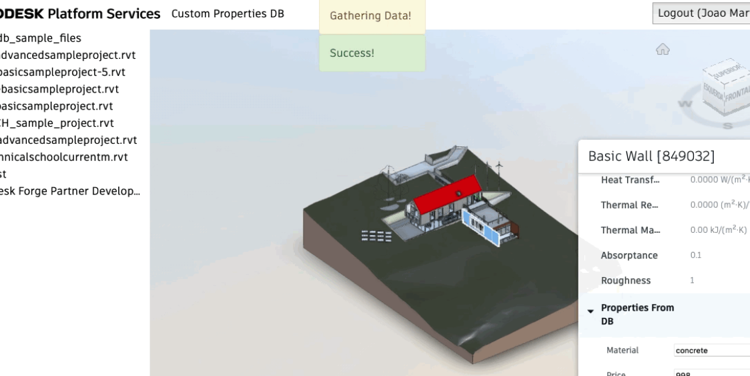
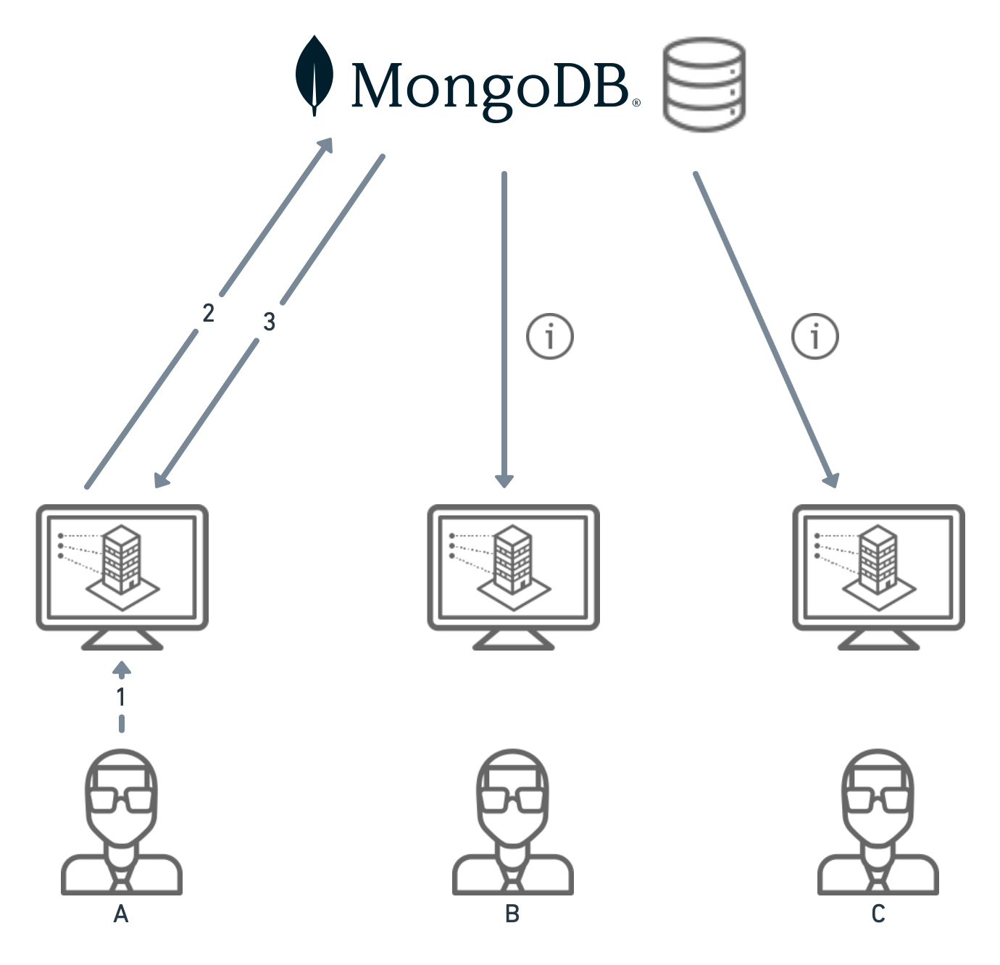

# aps-db-sample


[](http://opensource.org/licenses/MIT)
[](http://developer.autodesk.com/)

[](http://developer.autodesk.com/)
[](http://developer.autodesk.com/)
[](http://developer.autodesk.com/)
[](http://developer.autodesk.com/)

## Thumbnail



## Description

This sample demonstrates how to connect with an external DB on demand, adding custom properties to Viewer property panel.
It uses Websocket to notify different users when the parameters they might be seeing changes.
We can understand how it works dividing the connection to DB in two sections.

First, Reading the Data from DB and aggregating into property Panel.


1 - User select an element from the scene, which triggers a job to retrieve associated properties (specific to this element) from an external DB (MongoDB in this case)

2 - A task retrieves the associated properties from the external DB.

3 - If those properties exists they are returned and aggregated to the properties panel inside an input element, so the user can change them. If not, the properties are aggregated on properties panel as blank inputs, so user can write values to those, creating new values in the external DB.

Then, updating the properties from Viewer.



1 - User update a custom parameter on viewer’s property panel inputs, which triggers a job to update this parameters value in the external DB (MongoDB in this case).

2 - A task updates the property value (or create it, if it doesn’t exists).

3 - The client that triggered the task (A) get notified about the result, while other clients (B and C) receives a notification with the changed/created value.

# Setup

## Prerequisites

1. **APS Account**: Learn how to create a APS Account, activate subscription and create an app at [this tutorial](http://learnforge.autodesk.io/#/account/).
2. **Visual Studio**: Either Community (Windows) or Code (Windows, MacOS).
3. **.NET 6**: basic knowledge of C#.
4. **MongoDB Atlas**: Cloud-hosted MongoDB [refer here](https://www.mongodb.com/cloud/atlas/).

Use of this sample requires Autodesk developer credentials.
Visit the [APS Developer Portal](https://developer.autodesk.com), sign up for an account
and [create an app](https://developer.autodesk.com/myapps/create) that uses Data Management and Model Derivative APIs.
For this new app, use `http://localhost:3000/api/aps/callback/oauth` as Callback URL, although is not used in a 2-legged flow.
Finally, make a note of the **Client ID** and **Client Secret**.

## Running locally

Clone this project or download it.
We recommend installing [GitHub desktop](https://desktop.github.com/).
To clone it via command line, use the following (**Terminal** on MacOSX/Linux, **Git Shell** on Windows):

    git clone https://github.com/autodesk-platform-services/aps-db-sample

**Environment variables**

At the `.appsettings.Development.json`, find the env vars and add your APS Client ID, Secret and callback URL. The end result should be as shown below:

```json
  "APS_CLIENT_ID": "your APS app client id",
  "APS_CLIENT_SECRET": "your APS app client secret",
  "APS_CALLBACK_URL": "http://localhost:8080/api/auth/callback",
  "APS_BUCKET": "your bucket name",
  "MONGODB_CON_STRING": "your MongoDB connection string",
  "MONGODB_DBNAME": "your MongoDB DB name",
  "MONGODB_COLLECTION": "your MongoDB collection name",
  "DB_PROPERTIES_NAMES": "your comma separated properties"
```

## License

This sample is licensed under the terms of the [MIT License](http://opensource.org/licenses/MIT). Please see the [LICENSE](LICENSE) file for full details.

## Written by

Joao Martins [@JooPaulodeOrne2](https://twitter.com/JooPaulodeOrne2), [Developer Advocate](http://aps.autodesk.com)
